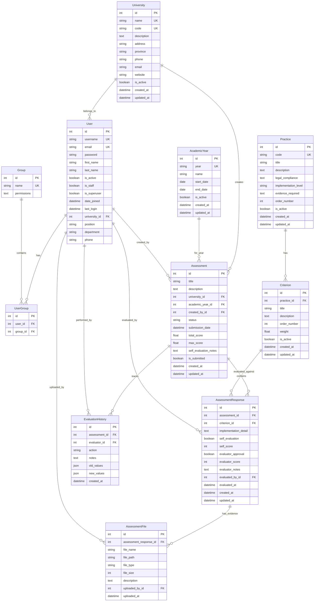

# PDPA Assessments System - ระบบประเมิน PDPA มหาวิทยาลัยราชภัฏ

## 1. Table: User (ผู้ใช้งาน)

**อธิบาย**: เก็บข้อมูลผู้ใช้งานระบบ รวมถึงบุคลากรและผู้ประเมิน

| Attribute     | Data Type    | Description                 |
| ------------- | ------------ | --------------------------- |
| id            | Integer (PK) | รหัสประจำตัวผู้ใช้          |
| username      | String (UK)  | ชื่อผู้ใช้สำหรับเข้าระบบ    |
| email         | String (UK)  | อีเมลผู้ใช้                 |
| password      | String       | รหัสผ่านที่เข้ารหัสแล้ว     |
| first_name    | String       | ชื่อจริง                    |
| last_name     | String       | นามสกุล                     |
| is_active     | Boolean      | สถานะการใช้งานของบัญชี      |
| is_staff      | Boolean      | สิทธิ์การเข้าถึงระบบ admin  |
| is_superuser  | Boolean      | สิทธิ์ผู้ดูแลระบบสูงสุด     |
| date_joined   | DateTime     | วันที่สร้างบัญชี            |
| last_login    | DateTime     | วันที่เข้าใช้งานครั้งล่าสุด |
| university_id | Integer (FK) | รหัสมหาวิทยาลัยที่สังกัด    |
| position      | String       | ตำแหน่งงาน                  |
| department    | String       | หน่วยงาน/คณะที่สังกัด       |
| phone         | String       | หมายเลขโทรศัพท์             |

## 2. Table: Group (กลุ่มผู้ใช้งาน)

**อธิบาย**: กำหนดบทบาทและสิทธิ์การใช้งานของผู้ใช้

| Attribute   | Data Type    | Description                              |
| ----------- | ------------ | ---------------------------------------- |
| id          | Integer (PK) | รหัสกลุ่ม                                |
| name        | String (UK)  | ชื่อกลุ่ม (เช่น staff, evaluator, admin) |
| permissions | Text         | สิทธิ์การใช้งานของกลุ่ม                  |

## 3. Table: UserGroup (การเชื่อมผู้ใช้กับกลุ่ม)

**อธิบาย**: ตารางเชื่อมระหว่างผู้ใช้และกลุ่มสิทธิ์

| Attribute | Data Type    | Description   |
| --------- | ------------ | ------------- |
| id        | Integer (PK) | รหัสการเชื่อม |
| user_id   | Integer (FK) | รหัสผู้ใช้    |
| group_id  | Integer (FK) | รหัสกลุ่ม     |

## 4. Table: University (มหาวิทยาลัย)

**อธิบาย**: ข้อมูลมหาวิทยาลัยราชภัฏต่างๆ ที่ใช้ระบบ

| Attribute   | Data Type    | Description         |
| ----------- | ------------ | ------------------- |
| id          | Integer (PK) | รหัสมหาวิทยาลัย     |
| name        | String (UK)  | ชื่อมหาวิทยาลัย     |
| code        | String (UK)  | รหัสย่อมหาวิทยาลัย  |
| description | Text         | รายละเอียดเพิ่มเติม |
| address     | String       | ที่อยู่             |
| province    | String       | จังหวัด             |
| phone       | String       | หมายเลขโทรศัพท์     |
| email       | String       | อีเมลหลัก           |
| website     | String       | เว็บไซต์            |
| is_active   | Boolean      | สถานะการใช้งาน      |
| created_at  | DateTime     | วันที่สร้างข้อมูล   |
| updated_at  | DateTime     | วันที่แก้ไขล่าสุด   |

## 5. Table: AcademicYear (ปีการศึกษา)

**อธิบาย**: ข้อมูลปีการศึกษาสำหรับการประเมิน

| Attribute  | Data Type    | Description              |
| ---------- | ------------ | ------------------------ |
| id         | Integer (PK) | รหัสปีการศึกษา           |
| year       | String (UK)  | ปีการศึกษา (เช่น 2567)   |
| name       | String       | ชื่อปีการศึกษา           |
| start_date | Date         | วันที่เริ่มต้นปีการศึกษา |
| end_date   | Date         | วันที่สิ้นสุดปีการศึกษา  |
| is_active  | Boolean      | สถานะการใช้งาน           |
| created_at | DateTime     | วันที่สร้างข้อมูล        |
| updated_at | DateTime     | วันที่แก้ไขล่าสุด        |

## 6. Table: Practice (แนวปฏิบัติ)

**อธิบาย**: เก็บข้อมูลแนวปฏิบัติทั้ง 28 ข้อตามเอกสาร PDPA

| Attribute            | Data Type    | Description                             |
| -------------------- | ------------ | --------------------------------------- |
| id                   | Integer (PK) | รหัสแนวปฏิบัติ                          |
| code                 | String (UK)  | รหัสแนวปฏิบัติ (เช่น P01, P02)          |
| title                | String       | ชื่อแนวปฏิบัติ                          |
| description          | Text         | รายละเอียดแนวปฏิบัติ                    |
| legal_compliance     | Text         | ความสอดคล้องกับกฎหมาย                   |
| implementation_level | String       | ระดับการปฏิบัติ (มหาวิทยาลัย/คณะ/สำนัก) |
| evidence_required    | Text         | หลักฐานที่ต้องการ                       |
| order_number         | Integer      | ลำดับการแสดงผล                          |
| is_active            | Boolean      | สถานะการใช้งาน                          |
| created_at           | DateTime     | วันที่สร้างข้อมูล                       |
| updated_at           | DateTime     | วันที่แก้ไขล่าสุด                       |

## 7. Table: Criterion (เกณฑ์มาตรฐาน)

**อธิบาย**: เกณฑ์มาตรฐานย่อยของแต่ละแนวปฏิบัติ (5-8 เกณฑ์ต่อแนวปฏิบัติ)

| Attribute    | Data Type    | Description                       |
| ------------ | ------------ | --------------------------------- |
| id           | Integer (PK) | รหัสเกณฑ์                         |
| practice_id  | Integer (FK) | รหัสแนวปฏิบัติที่เกี่ยวข้อง       |
| title        | String       | ชื่อเกณฑ์                         |
| description  | Text         | รายละเอียดเกณฑ์                   |
| order_number | Integer      | ลำดับในแนวปฏิบัติ                 |
| weight       | Float        | น้ำหนักคะแนน (เฉลี่ยรวมไม่เกิน 5) |
| is_active    | Boolean      | สถานะการใช้งาน                    |
| created_at   | DateTime     | วันที่สร้างข้อมูล                 |
| updated_at   | DateTime     | วันที่แก้ไขล่าสุด                 |

## 8. Table: Assessment (แบบประเมิน)

**อธิบาย**: แบบประเมินที่สร้างโดยบุคลากรแต่ละมหาวิทยาลัย

| Attribute             | Data Type    | Description                         |
| --------------------- | ------------ | ----------------------------------- |
| id                    | Integer (PK) | รหัสแบบประเมิน                      |
| title                 | String       | ชื่อแบบประเมิน                      |
| description           | Text         | รายละเอียดแบบประเมิน                |
| university_id         | Integer (FK) | มหาวิทยาลัยที่สร้างแบบประเมิน       |
| academic_year_id      | Integer (FK) | ปีการศึกษาที่ประเมิน                |
| created_by_id         | Integer (FK) | ผู้สร้างแบบประเมิน                  |
| status                | String       | สถานะ (draft, submitted, evaluated) |
| submission_date       | DateTime     | วันที่ส่งแบบประเมิน                 |
| total_score           | Float        | คะแนนรวมที่ได้                      |
| max_score             | Float        | คะแนนเต็ม                           |
| self_evaluation_notes | Text         | หมายเหตุการประเมินตนเอง             |
| is_submitted          | Boolean      | สถานะการส่งแบบประเมิน               |
| created_at            | DateTime     | วันที่สร้าง                         |
| updated_at            | DateTime     | วันที่แก้ไขล่าสุด                   |

## 9. Table: AssessmentResponse (คำตอบแบบประเมิน)

**อธิบาย**: คำตอบและผลการประเมินแต่ละเกณฑ์

| Attribute             | Data Type    | Description                      |
| --------------------- | ------------ | -------------------------------- |
| id                    | Integer (PK) | รหัสคำตอบ                        |
| assessment_id         | Integer (FK) | รหัสแบบประเมิน                   |
| criterion_id          | Integer (FK) | รหัสเกณฑ์ที่ตอบ                  |
| implementation_detail | Text         | รายละเอียดผลการดำเนินการ         |
| self_evaluation       | Boolean      | ผลการประเมินตนเอง (ผ่าน/ไม่ผ่าน) |
| self_score            | Integer      | คะแนนประเมินตนเอง                |
| evaluator_approval    | Boolean      | ผลการประเมินจากผู้ประเมิน        |
| evaluator_score       | Integer      | คะแนนจากผู้ประเมิน               |
| evaluator_notes       | Text         | หมายเหตุจากผู้ประเมิน            |
| evaluated_by_id       | Integer (FK) | ผู้ประเมิน                       |
| evaluated_at          | DateTime     | วันที่ประเมิน                    |
| created_at            | DateTime     | วันที่สร้าง                      |
| updated_at            | DateTime     | วันที่แก้ไขล่าสุด                |

## 10. Table: AssessmentFile (ไฟล์หลักฐาน)

**อธิบาย**: ไฟล์หลักฐานที่แนบประกอบการตอบแบบประเมิน

| Attribute              | Data Type    | Description         |
| ---------------------- | ------------ | ------------------- |
| id                     | Integer (PK) | รหัสไฟล์            |
| assessment_response_id | Integer (FK) | รหัสคำตอบที่แนบไฟล์ |
| file_name              | String       | ชื่อไฟล์            |
| file_path              | String       | ที่อยู่ไฟล์ในระบบ   |
| file_type              | String       | ประเภทไฟล์          |
| file_size              | Integer      | ขนาดไฟล์ (bytes)    |
| description            | Text         | คำอธิบายไฟล์        |
| uploaded_by_id         | Integer (FK) | ผู้อัปโหลดไฟล์      |
| uploaded_at            | DateTime     | วันที่อัปโหลด       |

## 11. Table: EvaluationHistory (ประวัติการประเมิน)

**อธิบาย**: บันทึกประวัติการเปลี่ยนแปลงและการประเมิน

| Attribute     | Data Type    | Description                            |
| ------------- | ------------ | -------------------------------------- |
| id            | Integer (PK) | รหัสประวัติ                            |
| assessment_id | Integer (FK) | รหัสแบบประเมิน                         |
| evaluator_id  | Integer (FK) | ผู้ดำเนินการ                           |
| action        | String       | การกระทำ (created, updated, evaluated) |
| notes         | Text         | หมายเหตุ                               |
| old_values    | JSON         | ค่าก่อนการเปลี่ยนแปลง                  |
| new_values    | JSON         | ค่าหลังการเปลี่ยนแปลง                  |
| created_at    | DateTime     | วันที่เกิดเหตุการณ์                    |

## ความสัมพันธ์ของตาราง

1. **University** มีผู้ใช้หลายคน (User) และแบบประเมินหลายชุด (Assessment)
2. **User** สามารถสร้างและประเมินแบบประเมินได้หลายชุด
3. **Practice** มีเกณฑ์ย่อยหลายข้อ (Criterion)
4. **Assessment** ประกอบด้วยคำตอบหลายข้อ (AssessmentResponse)
5. **AssessmentResponse** สามารถแนบไฟล์หลักฐานได้หลายไฟล์ (AssessmentFile)
6. ระบบติดตามประวัติการเปลี่ยนแปลงผ่าน **EvaluationHistory**

## หมายเหตุการออกแบบ

- ใช้ Django User model เป็นฐานและขยายด้วยข้อมูลเพิ่มเติม
- รองรับ Multi-tenancy ผ่าน university_id
- คะแนนคำนวณอัตโนมัติจากน้ำหนักของแต่ละเกณฑ์
- สนับสนุนการแนบไฟล์หลักฐานหลายไฟล์ต่อข้อ
- มี audit trail ผ่าน EvaluationHistory table
